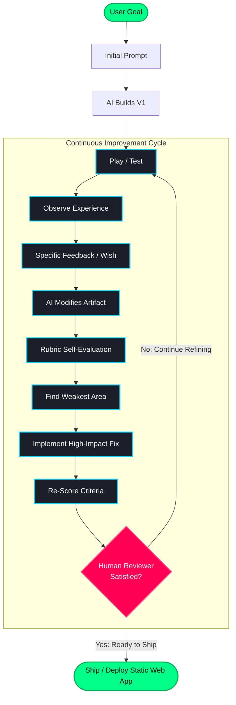

# Prompting Workflow Architecture & Diagram

This document illustrates the iterative loop architecture that powers modern AI-assisted engineering. Software improvement in 2026 is fundamentally cyclical rather than linear.

---

## Visual Workflow Diagram

```text
┌───────────────────────────────────────────────┐
│                   USER GOAL                   │
└───────────────────────┬───────────────────────┘
                        │
                        ▼
┌───────────────────────────────────────────────┐
│                INITIAL PROMPT                 │
└───────────────────────┬───────────────────────┘
                        │
                        ▼
┌───────────────────────────────────────────────┐
│                 AI BUILDS V1                  │
└───────────────────────┬───────────────────────┘
                        │
                        ▼
┌───────────────────────────────────────────────┐
│                  PLAY / TEST                  │◄──────────────┐
└───────────────────────┬───────────────────────┘               │
                        │                                       │
                        ▼                                       │
┌───────────────────────────────────────────────┐               │
│              OBSERVE EXPERIENCE               │               │
└───────────────────────┬───────────────────────┘               │
                        │                                       │
                        ▼                                       │
┌───────────────────────────────────────────────┐               │
│               SPECIFIC FEEDBACK               │               │
└───────────────────────┬───────────────────────┘               │
                        │                                       │
                        ▼                                       │
┌───────────────────────────────────────────────┐               │
│                 AI BUILDS V2                  │               │
└───────────────────────┬───────────────────────┘               │
                        │                                       │
                        ▼                                       │
┌───────────────────────────────────────────────┐               │
│                RUBRIC SCORING                 │               │
└───────────────────────┬───────────────────────┘               │
                        │                                       │
                        ▼                                       │
┌───────────────────────────────────────────────┐               │
│              FIND WEAKEST AREA                │               │
└───────────────────────┬───────────────────────┘               │
                        │                                       │
                        ▼                                       │
┌───────────────────────────────────────────────┐               │
│                HIGH-IMPACT FIX                │               │
└───────────────────────┬───────────────────────┘               │
                        │                                       │
                        └───────────────┐                       │
                                        ▼                       │
                                ┌──────────────┐                │
                                │   RE-SCORE   │                │
                                └───────┬──────┘                │
                                        │                       │
                                        └────────── LOOP ───────┘
                                                (If below threshold)
                                        │
                                        ▼
                                ┌──────────────┐
                                │ HUMAN REVIEW │
                                │ & SHIP / DEPLOY
                                └──────────────┘
```

---

## Mermaid State Progression



---

## Key Takeaways

1. **Anti-Waterfall**: No single prompt, however elaborate, can anticipate real human gameplay feel. Iteration is the primary driver of quality.
2. **Looping Mechanism**: The transition from `RE-SCORE` back to `PLAY / TEST` prevents premature stagnation and catches regressions early.
3. **Dedicated SVG Asset**: For standalone visual documentation, reference the vector graphic at `assets/diagrams/prompting-workflow.svg`.
